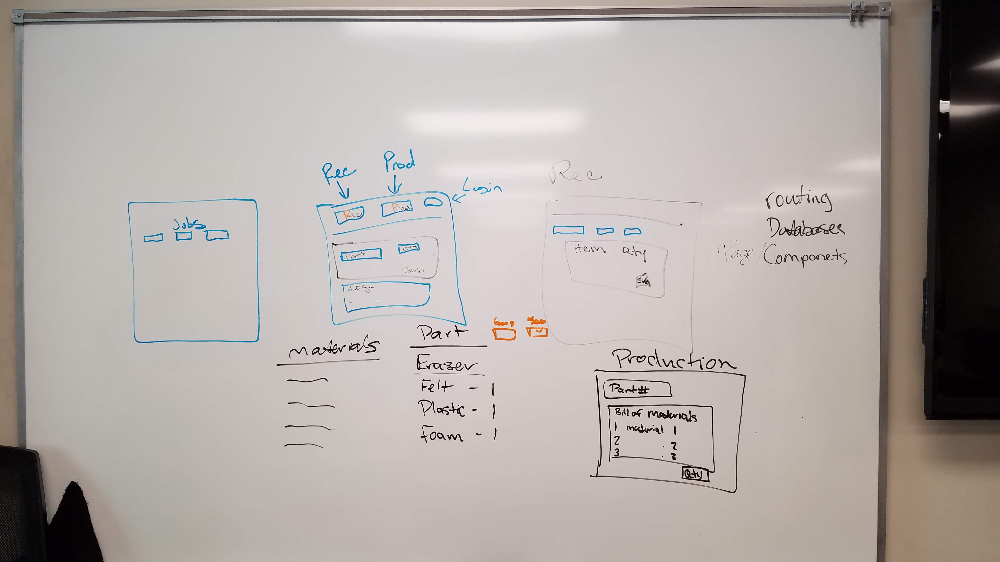

# SIM-Simple-Inventory-Manager

Here's our pseudocode:

### Overview ### 
This is Simple Inventory Manager or SIM for short. It's designed to help companies run more efficiently between processes and departments. This application is built to handle receiving, completing jobs, and final shippment of product. 

### Technologies Utilized
MongoDB, React, Express.js, Bootstrap, Heroku, mLab, passport, react modal, cookie sessions
